# 目标检测

目标检测是一个计算机视觉问题，在目标检测任务中我们需要设计一个检测器模型，期望这个检测器能够识别出图像中我们感兴趣的目标，这里对于识别的定义既包括识别出每个目标的类别，又要定位出每个目标在图像中的位置

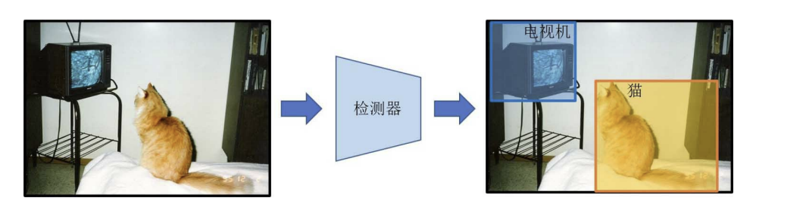

在深度学习到来之前，研究者对目标检测的路线可以划分为两个阶段：先从图像汇总提取人工视觉特征。再将这些视觉特征输入到分类器。

随后R-CNN问世，深度学习开始向目标检测进军，R-CNN的思路是向使用一个搜索算法从图像中提取出若干感兴趣的区域(region of interest, ROI)，然后使用一个卷积神经网络分别处理每一个ROI提取特征，最后使用一个支持向量机来完成最终分类，即先提取再识别的two-stage。

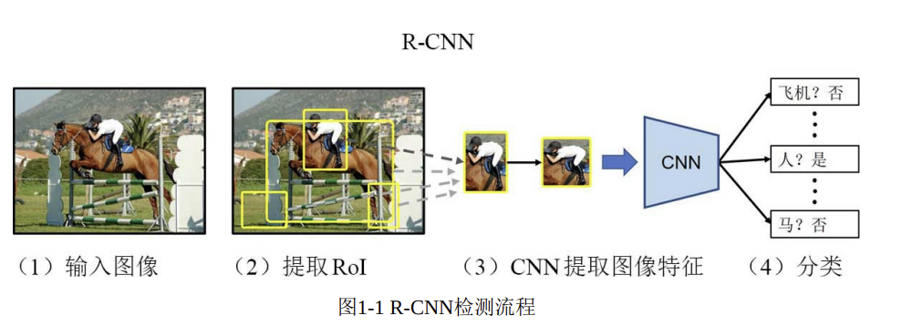

Yolo认为提取候选区域和注意是被完全可以有一个单独的网络来同时完成，无需划分为两个阶段，Yolo在检测速度上有天然的有时，这类工作被称为one-stage

# 目标检测的框架

目标检测网络的框架可以划分为三大部分：主干网络(backbone network)，颈部网络(neck network)，检测头(detection head)

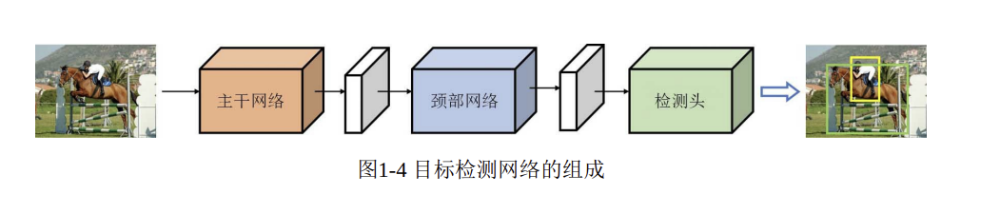

+ 主干网络：目标检测网络中最核心的部分，用于提取输入图像的高级特征，减少图像中冗余信息
+ 颈部网络：将主干网络输出的特征进行二次处理
+ 检测头：提取类别信息和位置信息，输出最终预测结果

# 常用的数据集

PASCAL VOC数据集，通常VOC2007的trainval数据与VOC2012的trainval数据会被组合在一起用于训练网络，而VOC2007的test数据会用做测试集来验证网络的性能。

此外还有COCO数据集，其数据规模更大，挑战性也更高。

# 术语

MAP mean average precision 平均准确度

FPS 帧数

# YOLOv1

## 检测原理

网络接受一个H*W的图像，该图像经由主干网络处理后山粗一个空间大小被降采样64倍的特征图，记作F

F是一个三维张量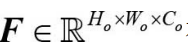

stride是网络的输出步长，其值为降采样倍数

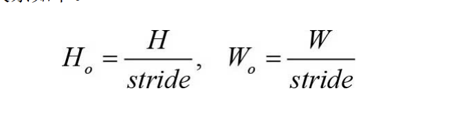

C则是提取出的特征向量

最后F再由若干全连接层处理以及一些必要的维度转换后，得到最终输出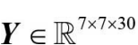

这里可以把Y想象为一个大的立方体，其中7*7是网络，每一个网格都是一个特征维度为30的向量

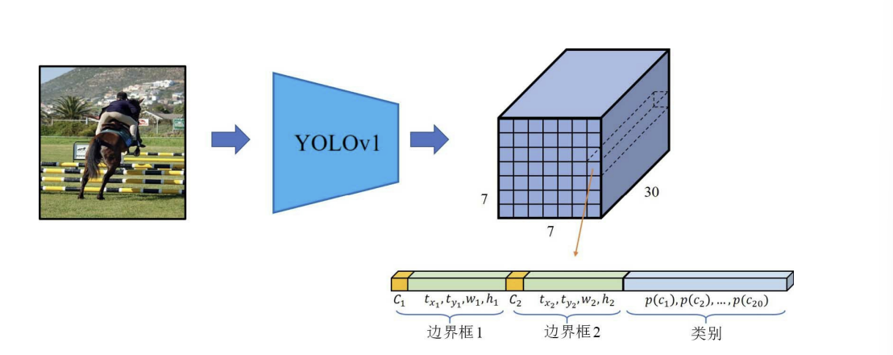

特征向量30张包含了两个边界框的参数以及总个数为20的类别数量，其中每个边界框都包含一个置信度C以及边界框的位置参数(x,y,w,h)，(x,y)是相对于网格单元的位置(归一化)，(w,h)是相对于整张图片的高和宽，向量可以表示为5B+N，其中B是边界框的个数，N是类别数量。

YOLOv1中设置边界框的个数为2，网络(红色框)对应两个边界框(黄色框)

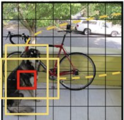

边界框的置信度使用IOU表示，即与真实框的交集/并集

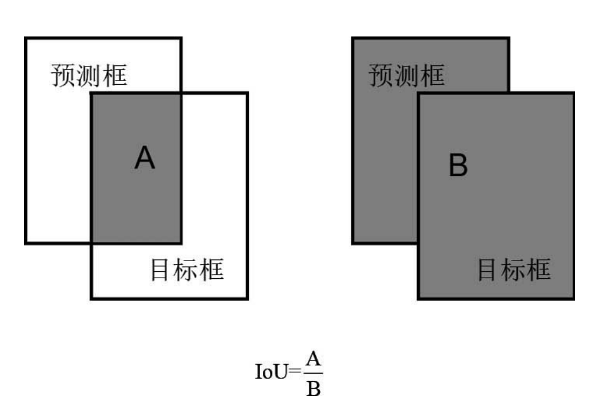

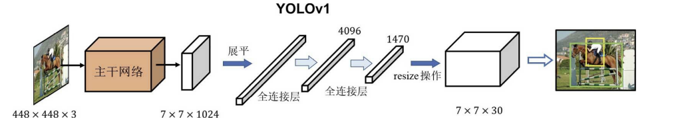

YOLOv1中使用动态标签分配，即每个物体只由一个网格单元预测(中心点所处)，在这个网络预测的多个边界框中选择IOU最大的，给它分配这个物体的标签，剩下的边界框则视为背景。

## 损失函数

YOLOv1的损失函数由三部分组成：坐标损失，置信度损失，分类损失

坐标损失：

+ 预测中心点与真实中心点的误差
+ 预测宽高与真实宽高的误差

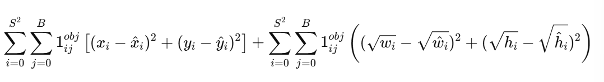

对宽高取根号可以让大物体和小物体的回归权重更均衡

$\mathbb{1}_{ij}^{obj}$：第 $i$ 个格子第 $j$ 个 box是正样本——格子内有物体中心点且j对应的bounding box的IOU最大

$\mathbb{1}_{ij}^{noobj}$：反之

置信度损失

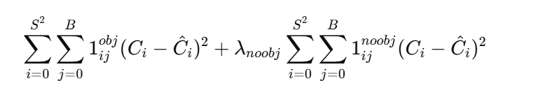

C是置信度，有目标时是IOU，没有则是0

分分类损失

每个格子也要做分类损失

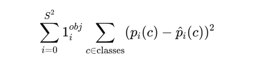

p是类别的概率(one-hot编码)

总体来看

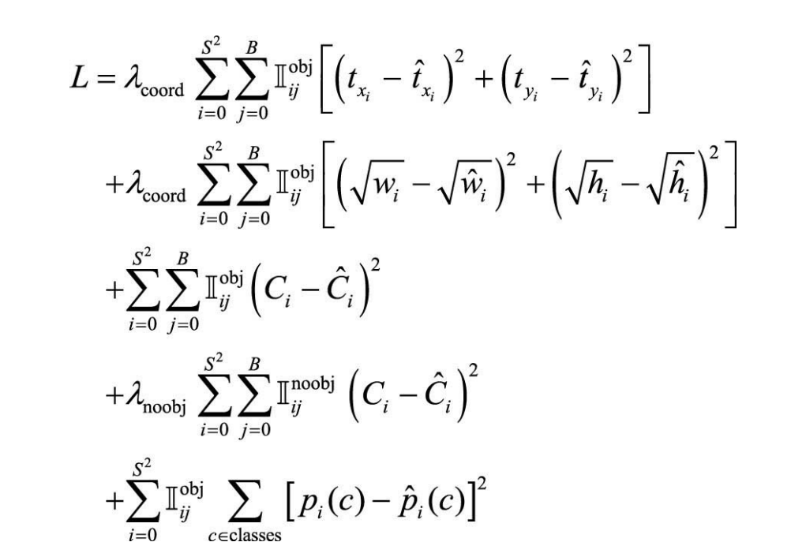

$\lambda_{coord}$：增加坐标误差的重要性（默认 5）

$\lambda_{noobj}$：降低无物体区域置信度损失的重要性（默认 0.5）

## 前向推理

对于给定的一张大小为448*448的图像，YOLOv1会输出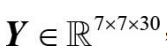

但实际只需要包含目标的网络所给出的预测，因此在得到最终的预测结果之前需要先进行过滤和筛选

 

1. 计算所有预测边界框的得分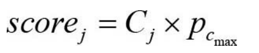，其中C是置信度，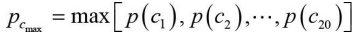
2. 得分阈值筛选，设定一个阈值滤除得分低的边界框，显然得分低的边界框都是不包含目标的中心点，背景，一般得分阈值设置位0.3
3. 计算剩余边界框的中心点坐标和宽高
4. 使用非极大值一致进行第二次筛选

